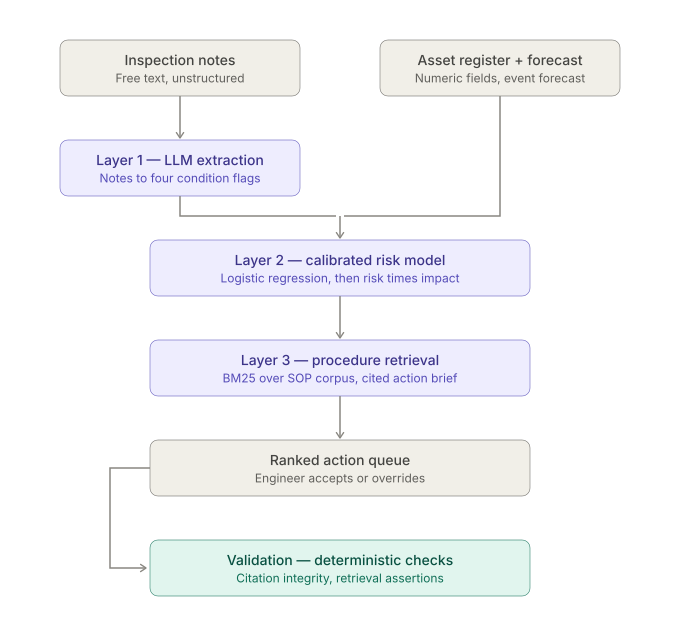

# heat-risk-triage

Ranking 900 substation transformers by heat-failure risk 72 hours ahead of a forecast heat event, so
a crew that can reach 15 of them knows which 15.

The output is a ranked queue with an explanation attached to every row: which factors drove the
score, what the recorded condition of the asset is, in the inspector's own words, and which
maintenance procedure applies.

All data is synthetic. Every number below came out of a run and is reproduced from the files in
`output/`.

## Problem

A utility receives a heat forecast. Some transformers will fail; the crew can reach a fraction of the
fleet before the event begins. Ranking by forecast severity alone is wrong, because failure depends
on the interaction between hazard exposure and the condition the asset is already in — and condition
is recorded in free-text inspection notes rather than in structured fields.

Heat damage also accumulates. Oil temperature lags ambient by a few hours, so a transformer
substantially *does* reset overnight: at the fast end of the modelled range it sheds 96% of its
offset over an eight-hour night. What the overnight minimum sets is the **floor it resets to**. A
night at 27°C instead of 18°C starts the next day nine degrees hotter, and each successive day
reaches a higher peak from a higher base. Because insulation ageing is Arrhenius and irreversible,
five days of elevated temperature does five days of damage that the weather breaking does not give
back.

That is why thermal stress here is accumulated *equivalent ageing* rather than a peak, and why
`max_overnight_min_c` and `consecutive_warm_nights` are features alongside degree-hours.

## Architecture



A batch pipeline writes JSON to `output/`; the web application only reads it.

1. **Extraction** (`extract.py`) — an LLM turns 1,800 free-text inspection notes into four boolean
   condition flags, each with a verbatim evidence quote. Two rules do the work: a defect the note
   records as *fixed* is false, and a defect the note records as *absent* is false. A ~20-line
   keyword baseline exists only as an evaluation comparator.
2. **Risk model** (`features.py`, `model.py`) — 13 features, `StandardScaler` → `LogisticRegression`,
   `GroupKFold(5)` grouped on `event_id`, evaluated on pooled out-of-fold predictions and refit on
   all 16 events to score the three demo scenarios.
3. **Retrieval** (`retrieve.py`) — BM25 over 25 procedure documents, with the query built
   deterministically from the asset's positive feature contributions, then an LLM action brief that
   may cite only the retrieved documents.
4. **Validation** (`validate.py`, `tests/`) — extraction against generation-time truth, retrieval
   assertions, citation integrity, and a leakage check.

The queue carries a crew-capacity control (5–25). It is the only input that changes which assets get
visited: the ranking is fixed for a given forecast, and capacity decides where the line falls across
it. Alongside it, the expected failures those visits would reach against the expected fleet total —
at the long-moderate scenario, 5 visits reach 0.1 of 5.3, 15 reach 0.4, 25 reach 0.6.

Forecast values are deliberately **not** adjustable. The ranking is invariant to hazard: varying the
scenario across ±3 °C of peak, 3–6 days and amplitudes 2.5–7.0 leaves the top 15 unchanged in every
case, because within one forecast every asset gets identical hazard features, so the hazard term is a
constant added to every log-odds and rescales all risks uniformly. A forecast slider would move every
percentage and reorder nothing. See `DECISIONS.md` D-022.

Priority is `risk × customers_served` — expected customers affected — so calibration matters as much
as discrimination. There is no class weighting, no resampling, and no post-hoc calibration layer.

Explanations are the model's own arithmetic: each contribution is `coefficient × standardised value`,
and they sum to `logit(p) − intercept`, asserted to 1e-6. No SHAP.

### Design constraints

- **Deterministic.** One seed. The same inputs produce byte-identical outputs; `generated_at` is a
  fixed constant rather than the clock, for that reason.
- **Runs with no API key.** Every LLM call is cached to disk by content hash and the cache is
  committed. `--offline` fails loudly on a cache miss rather than reaching for the network.
- **Offline at serve time.** `app.py` loads the scored JSON and briefs at startup. No inference, no
  network call, no CDN asset, no web font, no map tile at request time. Its only write is appending
  to `output/decisions.jsonl`.
- **No leakage.** Hazard features derive from ambient temperature alone. `theta`, `tau`, `load_rise`,
  `condition` and `thermal_stress` never enter the feature matrix. Only `validate.py` opens the
  diagnostic files.

## Running

Python 3.11+.

```bash
pip install -r requirements.txt

python generate_data.py   # data/, output/data_checks.txt
python extract.py         # cache/extractions/, output/extraction_cost.txt
python model.py           # output/scored_*.json, metrics.{json,md}, calibration.png
python retrieve.py        # output/briefs_*.json, output/bm25_scores.txt
python validate.py        # output/extraction_eval.md, output/validation.md
pytest tests/

uvicorn app:app --reload
```

Each script is independently re-runnable and idempotent. `extract.py` and `retrieve.py` accept
`--offline` to read the committed cache only. To re-run the LLM layers against the API, put a key in
`.env` as `GEMINI_API_KEY=...` — `.env` is gitignored.

## Scale

| Item | Count |
|---|---|
| Assets | 900 |
| Historical heat events | 16 |
| Training rows | 14,400 |
| Failures | 163 (1.13%) |
| Inspection notes | 1,800 (1,253 distinct texts) |
| Procedure documents | 25 |
| Demo scenarios | 3 |
| Action briefs | 75 |
| Crew capacity | 15 |

The fleet size is derived from the client brief rather than assumed: 8M residents ÷ ~2.5 per
household ≈ 3.2M customer accounts; ÷ ~8,000 per substation ≈ 400 distribution substations; × ~2.2
transformers each ≈ 900. The generated fleet totals 3,216,114 customers, which closes the loop.

## Assumptions

Every constant lives in `config.py` marked *chosen*, *measured* or *assumed*. The ones that carry
weight:

| Assumption | Value | Basis |
|---|---|---|
| Failure rate per asset per event | 0.01 | Inflated ~12× for trainability; see below |
| Ageing reference temperature | 38.0 °C | Proxy scale; this model tracks bulk oil, not winding hot-spot |
| Montsinger halving interval | 6 °C | Ageing rate doubles per 6 °C; literature range 6–8 |
| Oil thermal time constant | 3–8 h | Bulk oil, not winding (which responds in minutes) |
| Warm-night threshold | 24.0 °C | Overnight minimum above which recovery is materially reduced |
| Hazard coefficient scale | 2.4 | Measured; the centre of the band both gates leave |
| Customers per MVA | 92 | Substations run N-1, so customers per transformer sit well below rating |
| Cooling offset | ONAN +2, ONAF 0, OFAF −2 °C | Forced cooling sheds heat |
| Condition weights | age .35, maintenance .30, faults .20, noise .15 | Assumed |

### The failure rate is not an annual rate

CIGRE Technical Brochure 642 (2015), WG A2.37, *Transformer Reliability Survey* — 964 major failures
across 167,459 transformer-years, 56 utilities, 21 countries — puts substation transformer failure
below 1% per year: 0.8% for pre-1978 units, 0.4% for post-1978 units up to 20 years old. This fleet
skews old, so 0.8% applies.

**CIGRE supports the annual figure only.** It says nothing about a per-event rate. Deriving one — 900
assets × 0.8% annual × ~40% heat-attributable ÷ ~4 events a year — gives roughly **0.08% per
asset-event**. The generator uses **1%**, about twelve times that, because at the real rate 14,400
rows would carry about a dozen positives, too few to fit 13 features.

This scales predicted probabilities and preserves ranking, and the system consumes a ranking.
Calibration is to the synthetic base rate; a production deployment would recalibrate against observed
outcomes.

## Measured results

### Data gates

All six pass. `output/data_checks.txt`.

| Gate | Measured | Required |
|---|---|---|
| 1. Realised failure rate | 0.0113 | 0.008–0.013 |
| 2. Long-moderate stress > short-severe | 0.95 vs 0.71 equivalent days | strictly greater |
| 3. Non-zero stress on heat events | 0.9877 | ≥ 0.80 |
| 4. Mild-event failure rate | 0.0019 | < 0.002 |
| 5. Degree-hours vs peak correlation | 0.4961 | < 0.85 |
| 6. Failures in better-maintained half | 0.2086 (34 of 163) | ≥ 0.20 |

Gates 4 and 6 pull in opposite directions and leave a feasible band of [2.30, 2.50] for the hazard
scale; 2.4 is its centre. Both turn on single-figure failure counts, so the band is narrow by
construction. Details in `DECISIONS.md` D-014.

Failures by event type: mild 5, short-severe 19, long-moderate 37, long-severe 102. All 16 events
carry at least one failure.

### Extraction

1,800 notes, `gemini-3.5-flash-lite`, temperature 0. 1,253 API calls (duplicate note texts hit the
cache), 1,380,764 input and 182,123 output tokens.

**Zero extractions failed, zero were retried, zero came back wrapped in markdown fences. Zero of
1,708 evidence quotes were not found verbatim in their note** (spec expectation: under 2%).

| Flag | Actual positives | LLM P | LLM R | Keyword P | Keyword R |
|---|---|---|---|---|---|
| Cooling degraded | 380 | 0.922 | 0.958 | 0.652 | 1.000 |
| Ventilation obstructed | 374 | 0.895 | 0.979 | 0.744 | 1.000 |
| Oil issue | 407 | 0.875 | 0.963 | 0.702 | 0.725 |
| Outstanding remedial work | 390 | 0.855 | 1.000 | 0.826 | 0.826 |

The keyword baseline reaches recall 1.000 on two flags precisely because it cannot tell a fixed
defect from an outstanding one — it flags everything the words appear in. The cost shows up in
precision, and in the category breakdown:

| Note category | Notes | LLM error rate | Keyword error rate |
|---|---|---|---|
| Straightforward positive | 864 | 0.0110 | 0.0946 |
| Resolution present | 144 | 0.1302 | 0.3368 |
| Negation present | 148 | 0.2061 | 0.3108 |
| Distractors only | 644 | 0.0000 | 0.0000 |

Negation is the hardest case for both. A 20.6% error rate on it is the weakest measured result in
the extraction layer and is not hidden here.

### Model

Out-of-fold across 14,400 rows, `GroupKFold(5)` on `event_id`.

| Variant | Features | AUC | Precision@15 | Recall@15 | Failures per 15 visits | Lift |
|---|---|---|---|---|---|---|
| Heuristic (peak × age) | 2 | 0.5830 | 0.0000 | 0.0000 | 0.00 | 0.0× |
| Without notes | 9 | 0.8223 | 0.0458 | 0.0377 | 0.69 | 4.0× |
| Full model | 13 | 0.8261 | 0.0792 | 0.0609 | 1.19 | 7.0× |

Random selection of 15 assets would find 0.17 failures at the 1.13% base rate.

**AUC 0.8261 is above the 0.70–0.82 range the specification expected.** It is recorded as measured
and no parameter was adjusted to move it. It sits below the 0.90 line that would indicate leakage,
and `validate.py` confirms the highest correlation between any feature and the hidden state is
0.7695 (degree-hours against thermal stress), well under the 0.95 threshold.

**The notes move AUC by 0.0038 and precision@15 from 0.69 to 1.19 failures per 15 visits.** Those two
readings disagree because AUC integrates over every threshold and the crew only ever sees the top 15
of 900. A feature that sharpens the head of the ranking barely registers in AUC and matters entirely
in practice. Both are reported; neither alone is the honest summary.

Mean within-event AUC is **0.6219** — the operational question is "given *this* forecast, which
assets", and pooled AUC flatters it by including pairs that straddle two different events.

**Against the Bayes ceiling.** Ranking by the true generative probability is the best any model could
do, because it uses the exact hidden state that produced the outcomes:

| Ranked by | Pooled AUC | Within-event AUC | Precision@15 |
|---|---|---|---|
| The model (out-of-fold) | 0.8261 | 0.6219 | 0.0792 |
| True generative probability | 0.8483 | 0.7192 | 0.0833 |

The model reaches **86.5%** of achievable within-event AUC and **95.0%** of achievable precision at
the crew's capacity. A perfect oracle with full knowledge of the hidden state would find 1.25
failures per 15 visits against the model's 1.19. The absolute numbers are low because outcomes are
Bernoulli draws at a 1% rate — most of the variation is irreducible — not because the model is
leaving much on the table. Recomputed on every run by `validate.py`.

Calibration: Brier **0.01049** against **0.01119** for a base-rate-only baseline. Reliability diagram
in `output/calibration.png`.

Regularisation check, recorded not searched: C=0.01 → 0.8135, C=0.1 → 0.8264, C=1.0 → 0.8261,
C=10.0 → 0.8219.

**Coefficient signs.** Degree-hours (+1.14), peak load (+0.54), time since maintenance (+0.20),
prior faults (+0.11), age (+0.05) and all four condition flags (+0.01 to +0.27) are positive, as
expected. Cooling type is −0.84, which is also correct: the ordinal runs ONAN→ONAF→OFAF, so a higher
value means better cooling.

`max_overnight_min_c` comes out at **−0.30**, which looks wrong and is not. Univariately it
correlates **+0.094** with failure — the expected direction — but **+0.933** with degree-hours, which
takes the shared signal and the +1.14 coefficient. The negative value is the residual. A coefficient
on a feature collinear at r=0.93 with another is not interpretable on its own.

### Retrieval and briefs

75 briefs across three scenarios. **Citation integrity 100.00% (75 of 75)** — every brief cites only
documents it was given, against a spec expectation of ≥99%.

Top BM25 score per query ranges **13.97 to 25.59**, median 23.08. `BM25_FLOOR` is 12.0, below the
observed minimum. **It does not trigger on any of the 75 queries**, so no real query reaches the
`no_match` path; the floor was not raised into the main cluster to make it fire. The branch is
covered by two unit tests that reach it with a synthetic degenerate query instead. See
`DECISIONS.md` D-018.

81 tests pass. The cold-weather negative control is asserted exhaustively over the 39-term vocabulary
`build_query` can emit, not only over hand-written queries.

## Scope exclusions

Out of scope by decision, not oversight.

| Excluded | Why | What it would need |
|---|---|---|
| Water network (pumping stations, treatment) | Same architecture, different failure model. Building it twice adds no evidence. | Pump and treatment asset registers, hydraulic demand model |
| Other hazards (hurricane, flood, wildfire) | Heat has the longest intervention window and the most predictable failure mechanism. The architecture is hazard-agnostic — the risk model is the swappable part. | Hazard-specific models; flood needs elevation and hydrology data |
| Weather forecasting | The system consumes a forecast, it does not produce one. NWS/NOAA feeds are authoritative. | Nothing — permanently out of scope |
| Load forecasting | Needs real SCADA history to be credible. The risk ranking is useful without it. | 2–3 years of half-hourly load telemetry per asset |
| Anomaly detection on telemetry | Complementary, not substitutable. Detects developing faults continuously; this model ranks known condition against forecast stress. | Streaming SCADA integration, labelled fault history |
| Crew scheduling optimisation | The system ranks; it does not route. Optimisation needs crew locations, skills, shift rules and travel times. | Field operations system integration |
| Spatial / GIS analysis | GIS is a data dependency here, not an AI capability. Location and criticality enter as pre-computed fields. | PostGIS or equivalent, network topology model |
| Real-time integration | Runs on fixed forecast scenarios against cached data so it is reproducible and demonstrable offline. | Live feed adapters, scheduling, monitoring |
| LLM-as-judge evaluation of brief quality | Deterministic checks cover the failure modes that change decisions. A judge model would itself need validating. | A labelled set of good and bad briefs, plus human agreement measurement |
| Map view | Would require external tile services, breaking the offline property. `lat`/`lon` are stored as integration stubs only. | Local tile server or an accepted external dependency |

## Limitations

- **All data is synthetic.** The failure process is invented, and the model recovers a signal that
  was put there deliberately. Nothing here is evidence about real transformers.
- **The per-event failure rate is inflated about twelvefold** for trainability. Probabilities are
  calibrated to the synthetic world, not the real one. Ranking is unaffected.
- **Hazard is uniform across the fleet.** One hourly temperature series applies to all 900 assets. A
  real deployment would apply a forecast grid; `district`, `lat` and `lon` are carried for exactly
  that extension. This is why the scenarios carry no regional names.
- **Only one of the two heat pathways is modelled.** Ambient heating the coolant is represented;
  ambient driving electrical demand upward, which heats the windings further, is not. That is half of
  the "capacity falls while demand rises" argument, and the prototype does not make it.
- **Condition features describe the asset as of the forecast, not as of each historical event.** The
  register holds a single maintenance date and the notes are undated relative to past events, so
  `days_since_maintenance` and the four flags are static across the training window.
- **The model tracks bulk oil, not winding hot-spot.** Hot-spot is the governing variable in the
  standards, and the reference temperature here is a proxy on a different scale.
- **The BM25 floor never fires** on the current corpus and query construction. Suppressing the
  weakest query would mean discarding three correctly retrieved documents, so the `no_match` path is
  reached only by unit tests, never by real traffic.
- **30.4% of notes are duplicate texts**, concentrated entirely in notes with no outstanding defect.
  The distractors-only evaluation category rests on far fewer independent items than its note count
  suggests.
- **Mean within-event AUC is 0.6219**, and that is the number the operational task depends on — but
  the Bayes ceiling for it is 0.7192, so the headroom is small. The ranking is limited by the
  problem being mostly coin-flip at a 1% base rate, not by the model.
- **The crew reaches 1.7% of the fleet.** Capacity stayed at 15 while the fleet grew sixfold, so 15
  interventions now cover 15 of 900 rather than 15 of 150. Recall at 15 is correspondingly low in
  absolute terms.
- **Missed failures are the ones with no recorded defect.** The design ranks recorded condition
  against forecast stress, so an asset whose condition was never written down is invisible to it.
  Continuous telemetry is the thing that would catch those, and it is a listed exclusion.

## Repository

```
config.py                  all constants
generate_data.py           synthetic data generation and six hard gates
extract.py                 Layer 1 — LLM extraction, keyword baseline
features.py                feature computation, leakage boundary
model.py                   Layer 2 — train, evaluate, score, explain
retrieve.py                Layer 3 — BM25 + brief generation
llm.py                     one LLM call and the disk cache
validate.py                extraction eval, leakage check, citation integrity
app.py                     FastAPI application
templates/  static/        server-rendered UI, no JavaScript
data/                      generated artefacts and the procedure corpus
cache/                     cached LLM results, committed
output/                    scored JSON, briefs, metrics, plots
notebooks/                 analytical record, committed with outputs
tests/                     retrieval assertions, citation integrity
DECISIONS.md               20 entries, append-only
```

`DECISIONS.md` records every non-obvious choice, including the three that changed the shape of the
build: the thermal stress definition (D-008), the fleet-scale derivation (D-011), and the failure
rate (D-012).
